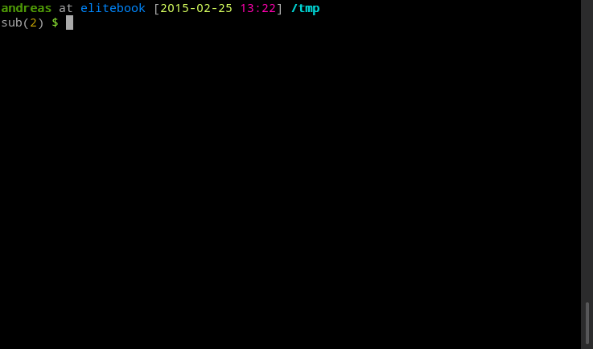

# goenv - virtual environments for [Go](https://golang.org/)

**goenv** lets you create virtual environments for your Go projects. This means that you can install all the dependencies locally for your project without cluttering your user- or system-wide `GOPATH`.

It was inspired by pythons [vex](https://pypi.python.org/pypi/vex) and opens a subshell for your Go virtual environment (in the following only `goenv`) and doens't mess with your environment variables, like pythons [virtualenv](https://github.com/pypa/virtualenv) does. To exit your *goenv* you only have to leave the subshell and your are in the exact same state where you started it.

**goenv** is a single bash script and has no other dependencies, except *Go*.

I've tested it with `bash` and `zsh`. Maybe it will work with other shells, too.

## Installation

The installation is super simple, you have to set the `GOENVS` environment variable and source the [`goenvs.sh`](goenvs.sh) script. Add the following lines to your `.bashrc/.zshrc`:

```sh
export GOENVS=~/path/to/goenvs      # create the directory
source /path/to/goenvs/goenvs.sh
```

If you've already the set the `GOPATH` globally, make sure that your `GOPATH` is only set if it's unset, so that **goenv** is able change it in a subshell. Substitute your `export GOPATH` with the following one and you are good to go:

```sh
export GOPATH=${GOPATH:-/default/gopath}
```

## Help

- run `goenv` without parameter or `goenv -h` to view the help.

## Demo



recorded with [tty2gif](http://z24.github.io/tty2gif/).

## Todo

- support for different go version (if someone needs this)
- changing the language is easy, so I want to port this for python
